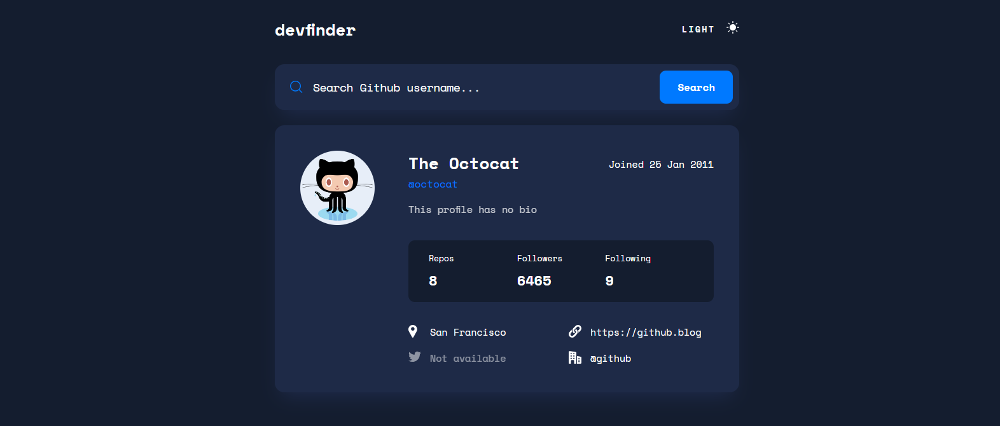

<h1 align="center">Frontend Mentor Challenges</h1>

This repository contains lists of projects that I completed from Frontend Mentor. Frontend Mentor challenge helps to improve coding skills by making you build realistic projects. Each project has it own challenge that helps to improve on the various aspects of Frontend Development. I have categorized them into 5 categories that is Newbie, Junior, Intermediate, Advanced and Guru.
Underneath each project is a picture, a link that directs you to the repository of the project, a live site link and also the technologies used in building such project or solving such challenge. Don't hesitate to contact me if you encounter a problem with one of the codes or have a different method or idea to simplify the code. My contact is at the end of this README file. I'm open to learn new things and open for collaborations. Scroll through and Enjoy!!

## Table of contents

- [Overview](#overview)
  - [The challenge](#the-challenge)
- [Newbie Projects](#newbie-projects)
- [Junior Projects](#junior-projects)
- [Intermediate Projects](#intermediate-projects)
- [Advanced Projects](#advanced-projects)
- [Guru Projects](#guru-projects)
- [Author](#author)

## Overview

### The challenge

Users should be able to:

- View the optimal layout depending on their device's screen size
- See hover states for all interactive elements on the page

## Newbie Projects

## 3 Column Preview Card

Built with: 
HTML |
CSS

- [Github Repo](https://github.com/kinjames/preview)
- [livesite](https://kinjames.github.io/preview/)

## Article Preview Component

Built with: 
HTML |
CSS

- [Github Repo](https://github.com/kinjames/preview)
- [livesite](https://kinjames.github.io/article-preview/)

## Base Apparel Coming Soon

Built with: 
HTML |
CSS

- [Github Repo](https://github.com/kinjames/coming-soon-page)
- [livesite](https://kinjames.github.io/coming-soon-page/)

## FAQ Accordion Card

Built with: 
HTML |
CSS

- [Github Repo](https://github.com/kinjames/faq-card)
- [livesite](https://kinjames.github.io/faq-card/)

## Four Card Feature Section

Built with: 
HTML |
CSS

- [Github Repo](https://github.com/kinjames/four-card-feature-section)
- [livesite](https://kinjames.github.io/four-card-feature-section/)

## Huddle Landing Page With Single Introductory Section

Built with: 
HTML |
CSS

- [Github Repo](https://github.com/kinjames/single-introductry-page)
- [livesite](https://kinjames.github.io/single-introductry-page/)

## Interactive Rating Component

Built with: 
HTML |
CSS | 
JavaScript

- [Github Repo](https://github.com/kinjames/interactive-ratings)
- [livesite](https://kinjames.github.io/interactive-ratings/)

## Intro Component With Sign-Up Form

Built with: 
HTML |
CSS | 
JavaScript

- [Github Repo](https://github.com/kinjames/form-validation)
- [livesite](https://kinjames.github.io/form-validation/)

## NFT Preview Card Component

Built with: 
HTML |
CSS

- [Github Repo](https://github.com/kinjames/nft-card)
- [livesite](https://kinjames.github.io/nft-card/)

## Order Summary Component

Built with: 
HTML |
CSS

- [Github Repo](https://github.com/kinjames/order-summary)
- [livesite](https://kinjames.github.io/order-summary/)

## Ping Coming Soon Page

Built with: 
HTML |
CSS

- [Github Repo](https://github.com/kinjames/coming-soon)
- [livesite](https://kinjames.github.io/coming-soon/)

## Product Preview Card Component

Built with: 
HTML |
CSS

- [Github Repo](https://github.com/kinjames/product-price)
- [livesite](https://kinjames.github.io/product-price/)

## Profile Card Component

Built with: 
HTML |
CSS

- [Github Repo](https://github.com/kinjames/profile-card)
- [livesite](https://kinjames.github.io/profile-card/)

## QR Code Component

Built with: 
HTML |
CSS

- [Github Repo](https://github.com/kinjames/qr-code)
- [livesite](https://kinjames.github.io/qr-code/)

## Single Price Grid Component

Built with: 
HTML |
CSS

- [Github Repo](https://github.com/kinjames/price-component)
- [livesite](https://kinjames.github.io/price-component/)

## Social Proof Section

Built with: 
HTML |
CSS

- [Github Repo](https://github.com/kinjames/social-proof)
- [livesite](https://kinjames.github.io/social-proof/)

## Stats Preview Card Component

Built with: 
HTML |
CSS

- [Github Repo](https://github.com/kinjames/stats-preview)
- [livesite](https://kinjames.github.io/stats-preview/)

## Junior Projects

## Advice Generator App

Built with: 
HTML |
CSS | 
JavaScript

- [Github Repo](https://github.com/kinjames/advice-generator)
- [livesite](https://kinjames.github.io/advice-generator/)

## Blogr Landing Page

Built with: 
HTML |
CSS | 
JavaScript

- [Github Repo](https://github.com/kinjames/blogr-landing-page)
- [livesite](https://kinjames.github.io/blogr-landing-page/)

## Clipboard Landing Page

Built with: 
HTML |
CSS | 
JavaScript

- [Github Repo](https://github.com/kinjames/clipboard-landing-page)
- [livesite](https://kinjames.github.io/clipboard-landing-page/)

## Coding Bootcamp Testimonial Slider

Built with: 
HTML |
CSS | 
JavaScript

- [Github Repo](https://github.com/kinjames/bootcamp-testimonials)
- [livesite](https://kinjames.github.io/bootcamp-testimonials/)

## Expense Chart Component

Built with: 
HTML |
CSS | 
JavaScript

- [Github Repo](https://github.com/kinjames/expenses-chart)
- [livesite](https://kinjames.github.io/expenses-chart/)

## Flyo Dark Theme Landing Page

Built with: 
HTML |
CSS | 
JavaScript

- [Github Repo](https://github.com/kinjames/fylo-dark-theme-landing-page)
- [livesite](https://kinjames.github.io/flyo-dark-theme-landing-page/)

## Github User Search App

Built with: 
HTML |
CSS | 
JavaScript

- [Github Repo](https://github.com/kinjames/github-user-search)
- [livesite](https://kinjames.github.io/github-user-search/)

## Flyo Landing Page With Two Columns

Built with: 
HTML |
CSS | 
JavaScript

- [Github Repo](https://github.com/kinjames/flyo-homepage)
- [livesite](https://kinjames.github.io/flyo-homepage/)

## Huddle Landing Page With Alternating Feature Blocks

Built with: 
HTML |
CSS | 
JavaScript

- [Github Repo](https://github.com/kinjames/h-landing-page)
- [livesite](https://kinjames.github.io/h-landing-page/)

## Huddle Landing Page With Curved Sections

Built with: 
HTML |
CSS | 
JavaScript

- [Github Repo](https://github.com/kinjames/landing-page-1)
- [livesite](https://kinjames.github.io/landing-page-1/)

## Interactive Card Details Form

Built with: 
HTML |
CSS | 
JavaScript

- [Github Repo](https://github.com/kinjames/card-details)
- [livesite](https://kinjames.github.io/card-details/)

## Loopstudios Landing Page

Built with: 
HTML |
CSS | 
JavaScript

- [Github Repo](https://github.com/kinjames/loopstudios)
- [livesite](https://kinjames.github.io/loopstudios/)

## Pricing Component With Toggle

Built with: 
HTML |
CSS | 
JavaScript

- [Github Repo](https://github.com/kinjames/pricing-component-toggle)
- [livesite](https://kinjames.github.io/pricing-component-toggle/)

## Project Tracking Component

Built with: 
HTML |
CSS | 
JavaScript

- [Github Repo](https://github.com/kinjames/project-tracking-intro-component)
- [livesite](https://kinjames.github.io/project-tracking-intro-component/)

## Sunnyside Agency Landing Page

Built with: 
HTML |
CSS | 
JavaScript

- [Github Repo](https://github.com/kinjames/sunnyside)
- [livesite](https://kinjames.github.io/sunnyside/)

## Testimonial Grid Section

Built with: 
HTML |
CSS | 
JavaScript

- [Github Repo](https://github.com/kinjames/grid-testimonials)
- [livesite](https://kinjames.github.io/grid-testimonials/)

## Time Tracking Dashboard

Built with: 
HTML |
CSS | 
JavaScript

- [Github Repo](https://github.com/kinjames/time-tracking-dashboard)
- [livesite](https://kinjames.github.io/time-tracking-dashboard/)

## Tip Calculator App

Built with: 
HTML |
CSS | 
JavaScript

- [Github Repo](https://github.com/kinjames/tip-calculator)
- [livesite](https://kinjames.github.io/tip-calculator/)

## Tip Calculator App

Built with: 
HTML |
CSS | 
JavaScript

- [Github Repo](https://github.com/kinjames/tip-calculator)
- [livesite](https://kinjames.github.io/tip-calculator/)

## Intermediate Projects

## Clock App

Built with: 
HTML |
CSS | 
JavaScript

- [Github Repo](https://github.com/kinjames/app-clock)
- [livesite](https://kinjames.github.io/app-clock/)

## Advanced Projects

## Clock App

Built with: 
HTML |
CSS | 
JavaScript

- [Github Repo](https://github.com/kinjames/app-clock)
- [livesite](https://kinjames.github.io/app-clock/)

## Guru Projects

## Clock App

Built with: 
HTML |
CSS | 
JavaScript

- [Github Repo](https://github.com/kinjames/app-clock)
- [livesite](https://kinjames.github.io/app-clock/)

## Author

- Frontend Mentor - [@kinjames](https://www.frontendmentor.io/profile/kinjames)
- Twitter - [@TheBlackCoder7](https://twitter.com/TheBlackCoder7)
